 
   

 

  

---

  <h2>🚀 About Me</h2>

<table align="center" width="100%">
  <tr>
    <td width="60%" valign="top">
      <h3>👨‍💻 Developer Profile</h3>
      
I'm <b>Abhay Chauhan</b>, a final-year BCA (Artificial Intelligence) student at Invertis University. I focus on building production-grade AI and full-stack applications—moving beyond toy projects to design, build, and deploy end-to-end.

      <ul>
        <li>🔹 Building AI-powered applications and automation systems</li>
        <li>🔹 Working with LLMs, RAG pipelines, and intelligent workflows</li>
        <li>🔹 Full-stack development with FastAPI / Spring Boot / React</li>
        <li>🔹 Preparing for software developer / backend / AI-ML placement roles</li>
        <li>🔹 Open to collaborating on meaningful open-source projects</li>
      </ul>
    </td>
    <td width="40%" valign="top">
      <h3>🎯 Current Focus</h3>
      <ul>
        <li>🤖 <b>AI/ML:</b> Applied LLM integration (Claude, OpenAI)</li>
        <li>⚡ <b>Backend:</b> FastAPI & Spring Boot systems</li>
        <li>🌐 <b>Frontend:</b> React + MongoDB/MySQL apps</li>
        <li>📊 <b>Data:</b> Analytics platforms</li>
        <li>🧠 <b>Core:</b> DSA & Java for technical interviews</li>
      </ul>
    </td>
  </tr>
</table>

---

  <h2>🌟 Featured Project</h2>

<table align="center" width="100%">
  <tr>
    <td align="center" width="100%">
      <h3><a href="https://slangnormai.vercel.app">🔤 SlangNorm AI</a></h3>
      
<i>A full-stack SaaS tool that normalizes internet slang into plain text using live AI inference.</i>

      
<b>Stack:</b> React/Vite · AI Inference API &nbsp;|&nbsp; <b>Deployed:</b> Vercel

    </td>
  </tr>
</table>

---

  <h2>⚡ Tech Stack</h2>

<table align="center" width="100%">
  <tr>
    <td align="center" width="50%">
      <h3>💻 Languages</h3>
      
      
      
      
    </td>
    <td align="center" width="50%">
      <h3>⚙️ Frameworks & Libraries</h3>
      
      
      
      
    </td>
  </tr>
  <tr>
    <td align="center" width="50%">
      <h3>🗄️ Databases & Tools</h3>
      
      
      
      
    </td>
    <td align="center" width="50%">
      <h3>🧠 AI & Machine Learning</h3>
      
      
      
    </td>
  </tr>
</table>

---

  <h2>📊 GitHub Analytics & Activity</h2>
   
  
  
  
  
    
  
  
  
    
  
  
  
    
  
  

---

  <h2>🌐 Let's Connect</h2>
  
Always open to discussing tech, AI, or exciting opportunities.

  
  
  &nbsp;&nbsp;
  

     

  <h3>⚡ Building the Future, One Commit at a Time</h3>

  

